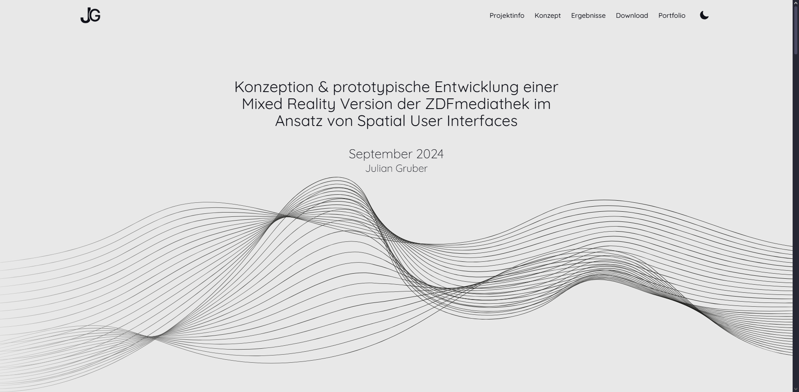

# XRMaster

**XRMaster** ist eine kompakte, webbasierte Präsentation meiner Masterarbeit mit dem Titel:  
**„Konzeption und prototypische Entwicklung einer Mixed-Reality-Version der ZDFmediathek im Ansatz von Spatial User Interfaces.“**

Das Projekt untersucht, wie Medienplattformen für immersive Umgebungen neu gedacht werden können – mit Fokus auf Mixed Reality (MR) und nutzerzentrierte Gestaltungsansätze.

---

## Verwendete Technologien

- **Vite**
- **React**
- **JavaScript**
- **TailwindCSS**
- **Adobe XD**

---

## Funktionen

- Strukturierte und übersichtliche Präsentation der Masterarbeit
- Vorstellung des Konzepts und des Spatial-UI-Prototyps
- Modulare React-Komponenten und responsive Gestaltung
- Verwendung von CSS-Variablen für Dark Mode und Design Tokens
- Optimiert für Desktop-Darstellung

---

## Hinweis

Diese Website dient ausschließlich der **nicht-kommerziellen Präsentation** meiner Masterarbeit.

Alle verwendeten Marken und Bezeichnungen (z. B. **ZDF**) sind Eigentum der jeweiligen Rechteinhaber und werden ausschließlich zu **veranschaulichenden und akademischen Zwecken** verwendet.

---

## Live-Demo

🔗 [Projekt ansehen](https://xrmaster.netlify.app)
